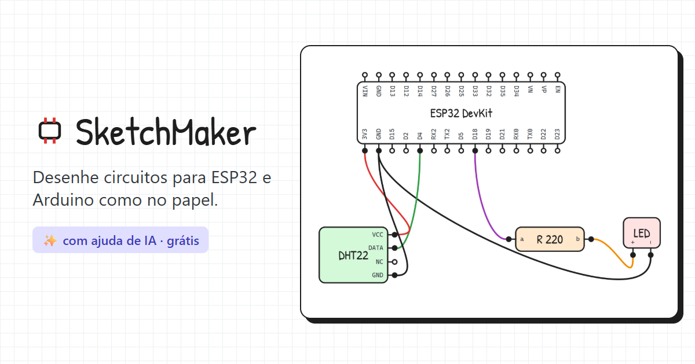

# SketchMaker

[](LICENSE)

Rabiscador de circuitos para protótipos (ESP32 & cia), feito com React Flow.
Componentes são retângulos com pinos nomeados; os fios ligam pino a pino.
E você pode pedir para uma IA montar o circuito para você.

**Use agora: [sketchmaker.vercel.app](https://sketchmaker.vercel.app)**



## Como usar

- **Novo componente**: dê um nome e liste os pinos de cada lado (`3V3, GND, D15...`).
  Marque "Salvar também na biblioteca" para reutilizar.
- **Ligar**: arraste de um pino até outro pino.
- **Ponta solta**: solte o fio no vazio. Depois arraste a ponta até um pino para ligar.
- **Tesoura (C)**: clique num fio para cortar; ficam duas pontas soltas.
- **Junção (J)** ou **duplo clique no fio**: cria um ponto no meio do fio. Arraste o
  centro do ponto para puxar um fio novo (junção) ou a borda para mover (dobra).
- **Unir**: solte um ponto (ponta/dobra/junção) em cima de um pino ou de outro ponto.
- Selecionar um fio destaca todo o circuito ligado a ele.
- `R` gira, `Ctrl+D` duplica, `Del` apaga, `Ctrl+Z`/`Ctrl+Y` desfaz/refaz.
- Arrastar no vazio seleciona; botão do meio, botão direito ou espaço+arrastar move a tela;
  `Ctrl+scroll` dá zoom.

O projeto é salvo automaticamente no navegador. Use os botões da barra para
salvar/abrir `.json` e exportar `.png`.

## Criar circuitos com IA

1. **Copiar para IA** (barra lateral): copia instruções do formato, a biblioteca de
   componentes e o circuito atual. Cole num chat (Claude, ChatGPT...) e escreva seu pedido no final.
2. A IA explica o circuito e devolve um bloco ```json.
3. **Colar resposta da IA**: cole a resposta inteira; o app mostra quantos componentes/fios
   achou e avisa sobre pinos ou componentes que não existem. Depois é só importar (Ctrl+Z desfaz).

O `.json` salvo pela barra usa o mesmo formato simplificado, legível para humanos e IAs:

```json
{
  "app": "sketchmaker", "format": "simple", "version": 1,
  "components": [
    { "id": "esp", "template": "ESP32 DevKit" },
    { "id": "r1", "template": "R 10k", "label": "R 220" },
    { "id": "led", "template": "LED" }
  ],
  "wires": [
    { "from": "esp.D18", "to": "r1.a", "color": "purple" },
    { "from": "r1.b", "to": "led.+", "color": "red" },
    { "from": "led.-", "to": "esp.GND#2", "color": "black" }
  ]
}
```

Especificação completa: `AI_FORMAT_SPEC` em `src/aiPrompt.ts`. O formato guarda componentes,
posições e ligações; dobras e junções desenhadas à mão viram ligações diretas entre os pinos.

## Rodando localmente

Requer Node.js 20+.

```bash
npm install
npm run dev      # servidor de desenvolvimento
npm run build    # checa tipos e gera a versão de produção em dist/
```

Stack: React, TypeScript, Vite, [React Flow](https://reactflow.dev) e Zustand.
O ponto de partida do código está em [CLAUDE.md](CLAUDE.md).

## Contribuindo

Contribuições são bem-vindas: novos componentes na biblioteca, correções e ideias.
Veja [CONTRIBUTING.md](CONTRIBUTING.md).

## Licença

[MIT](LICENSE): pode usar, modificar e redistribuir, mantendo o aviso de copyright.
